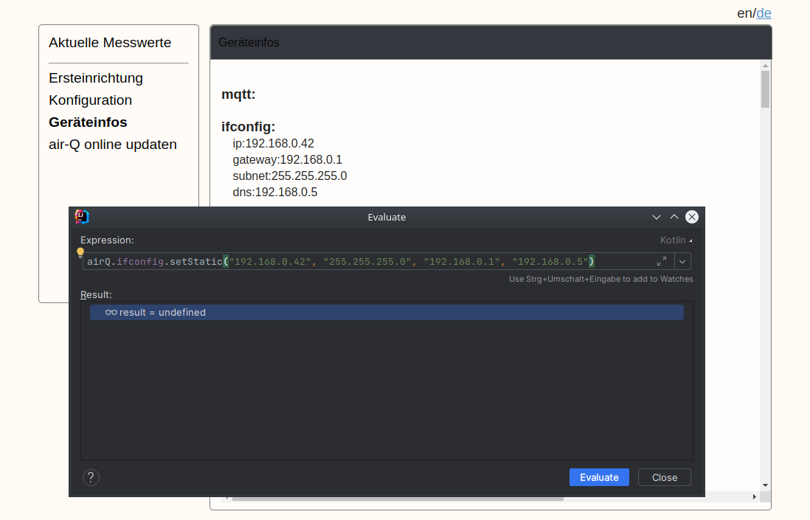
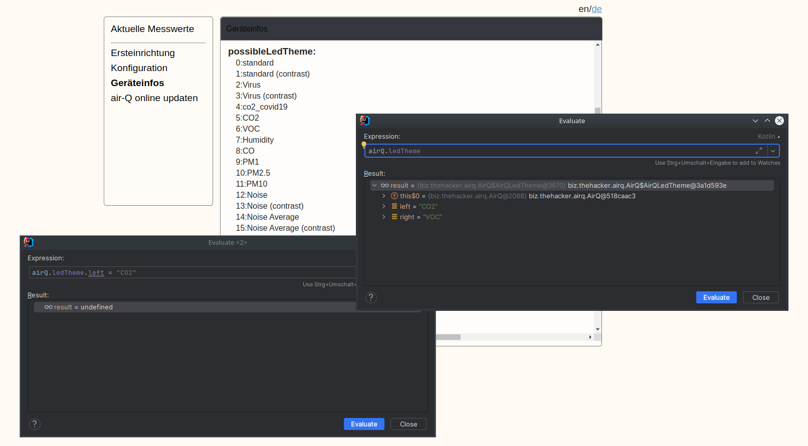

# air-q-kotlin

`air-q-kotlin` is a small helper written in Kotlin giving you the ability to access
commonly required features which are missing in air-Q's UI and official Python library
[`aioairq`](https://github.com/CorantGmbH/aioairq).

## Motivation

I bought air-Q because it's advertised as "Cloud is optional". However, I was very 
disappointed when the built-in UI did not allow me to set any relevant configuration.
One cannot set the many LED themes the device supports, it's not even possible to
configure the IP setup. 😒

Support initially redirected me to official apps for Android and iOS. This is of course
not the same as "Cloud", but for privacy-concerned people (like me 🤓) this is also
unacceptable. I do not want to install additional software on some phone to configure 
another device.

Luckily, both the Python library and air-Q UI's JavaScript show how to access the API
and from the structure of the config data one can easily guess what data to set to.
This is how `air-q-kotlin` was born.

At this point, a thanks to the air-Q guys, providing me with additional documentation,
making it a bit easier for me. 😀

## Features

The following table compares all supported features between `air-q-kotlin`, 
the air-Q's UI and the official Python library (as of 2023-04-11).

| Feature                                       | supported by `air-q-kotlin` | supported by air-Q's UI | supported by `aioairq` |
|-----------------------------------------------|:-------------------------------:|:---------------------------:|:--------------------------:|
| check for correct password by `ping` endpoint |                ✅                |              -              |             ✅              |
| read all configuration keys/values            |                ✅                |              ✅              |             ✅              |
| read current data                             |                ✅                |              ✅              |             ✅              |
| read average data                             |                ❌                |              ❌              |             ✅              |
| access the device's log                       |                ✅                |              ❌              |             ❌              |
| set WLAN login data                           |                ❌                |              ✅              |             ❌              |
| set air-Q's password                          |                ❌                |              ✅              |             ❌              |
| read/change the device's category             |                ❌                |              ✅              |             ❌              |
| read/change the device's name                 |                ✅                |              ✅              |             ❌              |
| enable/disable cloud upload                   |                ❌                |              ✅              |             ❌              |
| enable/disable cloud remote                   |                ✅                |              ❌              |             ❌              |
| trigger firmware update                       |                ❌                |              ✅              |             ❌              |
| configure NTP server                          |                ✅                |              ❌              |             ❌              |
| configure custom IP setup (disabling DHCP)    |                ✅                |              ❌              |             ❌              |
| set IP setup back to DHCP                     |                ✅                |              ❌              |             ❌              |
| set LED brightness                            |                ✅                |              ❌              |             ❌              |
| set LED brightness (day/night mode)           |                ✅                |              ❌              |             ❌              |
| set LED theme (individually for each side)    |                ✅                |              ❌              |             ❌              |
| identify air-Q device (by blinking its LEDs)  |                ✅                |              ❌              |             ❌              |
| manually restart air-Q device                 |                ✅                |              ❌              |             ❌              |
| gracefully shutdown air-Q device              |                ✅                |              ❌              |             ❌              |

air-Q has a lot more features to be configured. I only implemented the missing things 
I needed for it to operate. Also, air-Q support warned me not every feature is available
for every device tier. So I tinkered with my device as little as possible.

## Usage

`air-q-kotlin` is not a nice console tool, but for "run once".

- Go to [Main.kt](src/main/kotlin/biz/thehacker/airq/Main.kt), 
  uncomment and change the parts you need.
- Setup environment variables
  - `AIRQ_HOST` (mDNS name or current IP address) and
  - `AIRQ_PASSWORD`.
- Run the application.

As the better alternative, you can use an IDE (I used IntelliJ).

- Create a run configuration with above environment variables.
- But a breakpoint in `Main.kt` after `airQ` is declared,
  that is the `}` line.
- Run in Debug mode.
- Use "Evaluate Expression" on the `airQ` instance to read 
  from/apply to your air-Q device instantly. 😎

## Screenshots

### Custom IP setup

### Accessing LED theme configuration

